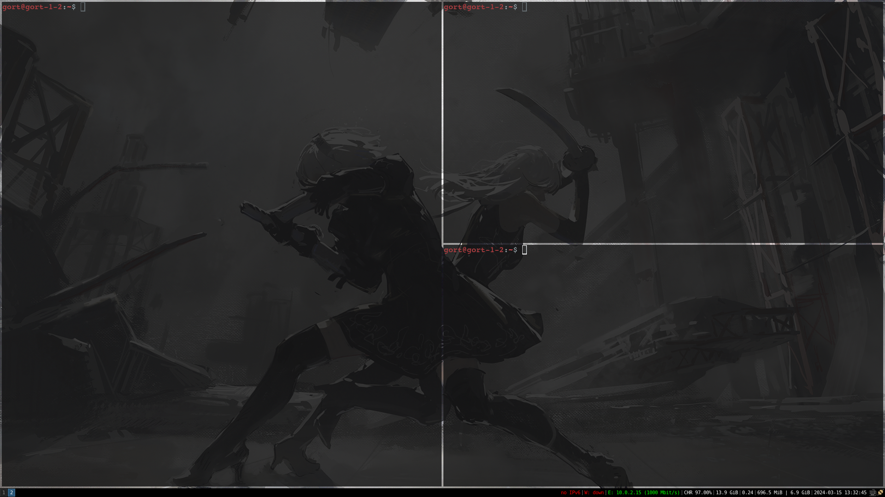

# Setup Documentation


> [!WARNING]
> This is in progress and is bound to get a rewrite sometime in the future.


## Dual Boot Configuration
Generally aesthecially speaking I want the GRUB bootloader to be the main bootloader instead of the prebuilt windows one. Though, it isn't a big deal If it's not possible.

Windows installs just fine on my Laptop, spam `F5` on reboot and go through the boot loader thingy.

https://ubuntu.com/download/desktop

Go for the not LTS version release but the absolute most latest version at the time of writing it was Ubuntu 23.10. This is because there was issues installing i3wm-gaps last time I installed, but it's probably been fixed by now.

- https://www.youtube.com/watch?v=mXyN1aJYefc
- https://askubuntu.com/questions/52963/how-do-i-set-windows-to-boot-as-the-default-in-the-boot-loader


### Parititon Size
The goal here is to focus on a system that is small and minimal. The partition size should be not exceed 100GB as that is too much and will probably start interfering with Windows as the programs I install there are quite heavy.

https://help.ubuntu.com/community/DiskSpace

 - Root Partition (40GB) 
 - SWAP (very reccommended) (20GB)
 - Home Partition (20GB) (Probably just used for notes)


## Desktop Environment
```
xrandr --output DP-2 --mode 1920x1080 --rate 144.00
xrandr --output HDMI-1 --rotate right --right-of DP-2
```

To make these settings persist on reboot, put `exec --no-startup-id` before the command in the i3 config file. There isn't really a reason why it should be `exec_always`


## ROG Zephyrus GA502DU
This is the laptop that I use... it's alright, just wish the battery didn't die on me so often.

- https://ubuntuforums.org/showthread.php?t=2440670
- https://github.com/gortbrown/ga502-ubuntu
- https://gitlab.com/asus-linux/asusctl


## Ubuntu



```
exec_always --no-startup-id feh --bg-fill /path/to/your/image.jpg

gaps inner 4
default_border none
```


Then you want to set the default start app to terminology and set the background opacity to 85% enabling translucency

> [!NOTE]
> Just want to state that translucency wasn't working until I installed picom and rebooted my machine, whether that is a coincidence
> or that terminology relies on a compositor to be installed in unknown to me. It would probably be worth to look into that on a virtual
> machine sometime.


### Dependencies
- https://github.com/i3/i3
- https://github.com/yshui/picom
- https://github.com/borisfaure/terminology
- https://github.com/dylanaraps/neofetch
  - https://github.com/dylanaraps/neofetch/wiki/Custom-Ascii-art-file-format (Custom ASCII documentation)
  - https://github.com/dylanaraps/neofetch/wiki/Images-in-the-terminal (Images in the Terminal)
- https://github.com/aristocratos/bashtop
- https://github.com/powerline/powerline I think I used something else not sure forgot to document
- https://github.com/derf/feh If I'm not mistaken I used feh to set the wallpaper
- https://github.com/davatorium/rofi
- https://github.com/betterlockscreen/betterlockscreen
- https://github.com/polybar/polybar


5/08/2024 Wallpaper credit: https://twitter.com/dino_illus/status/1618947057192173568?t=iWFKlDRCUYe3LteniwmAjg (By Dino)
Inspirations:
 - [Garuda Sway Config](https://github.com/yurihikari/garuda-sway-config)
 - [i3wm Nord](https://github.com/TheDistroHopper/i3wm-nord)
 - [NieR:Automata](https://www.reddit.com/r/unixporn/comments/bngsiy/i3gaps_nierautomata_first_encounter_with_my_ricer/)


### Applications
 - https://github.com/Rigellute/spotify-tui
 - https://neovim.io/


### Install Script
For easy install of all dependecies.
> [!WARNING]
> Install Script hasn't been coded yet


### Setting up GitHub on Linux
You can setup github by using [github cli](https://docs.github.com/en/get-started/getting-started-with-git/caching-your-github-credentials-in-git), make sure to install it using apt otherwise you WILL run into issues.

### Custom Login Screen
One of the things that intrigue me is a custom login screen, one of the solutions proposed since it is quite difficult to cusomize the login screen on ubuntu anyways was to make it login automatically and execute i3lock or an equivalent on bootup.

 - https://github.com/betterlockscreen/betterlockscreen


## Debugging and Crash Logs
Useful commands:
```
journalctl -xe
```

Useful Directories
```
/var/log
/var/crash
~/.xsession-errors
```

### Windows 
To mount the NAS on windows you go to "Add a Network Location", and then type `\\{ip_address_of_NAS}\{shared_folder}` with both the `ip_address_of_NAS` and `shared_folder` being replaced by their respective counterparts.

Then you type the username and password of the user designated by OpenMediaVault.


# Network Configuration

- `51820` for wireguard
- `4242` for openmediavault
- `4343` for syncthing


## WireGuard Configuration
https://github.com/pirate/wireguard-docs

I use wireguard as my way to connect to my raspberry pi

I want to subnet since I have two seperate networks that I want to manage
```
Address = 10.10.26.1/25, 10.10.26.129/25
```

> Defines what address range the local node should route traffic for. Depending on whether the node is a simple client joining the VPN subnet, or a bounce server that's relaying traffic between multiple clients, this can be set to a single IP of the node itself (specified with CIDR notation), e.g. 192.0.2.3/32), or a range of IPv4/IPv6 subnets that the node can route traffic for.

Well in this case, probably can look to add local ip address of the OpenMediaVault NAS so that it looks like this. Not too sure though.

```
Address = 10.10.26.1/25, 10.10.26.129/25
```

I have absolutely no clue how to make it so that I can access the NAS with wireguard. I had a look here https://wiki.omv-extras.org/ since they have wireguard options, but I don't know whether that creates the interface like how PiVPN does it.

For future you might want to look at this: https://docs.pivpn.io/wireguard/#pi-hole-with-pivpn but there is no real use for it at the moment that I can think off.

https://forum.openmediavault.org/index.php?thread/40438-how-to-install-wireguard-vpn-in-docker-server-mode/

https://forum.openmediavault.org/index.php?thread/43942-how-to-configure-wireguard-vpn-server-on-the-host/


## IPTables
IPTables has three default tables INPUT, FORWARD, and OUTPUT

> [!CAUTION]
> DO NOT USE THESE IPTABLE RULES, THERE ARE HERE FOR REFERENCE PURPOSES AT THE MOMENT.

```
# preup.sh
# Allow certain IP Addresses to access SSH
iptables -A INPUT -p tcp --dport 22 -s 10.10.10.2 -j ACCEPT
iptables -A INPUT -p tcp --dport 22 -s 10.10.10.11 -j ACCEPT
iptables -A INPUT -i wg0 -p tcp --dport 22 -j DROP

# Minecraft Server
iptables -A INPUT -i wg0 -p tcp --dport 25565 -j ACCEPT
iptables -A INPUT -i wg0 -j DROP

# OpenMediaVault
iptables -A FORWARD -i wg0 -o wlan -d 192.168.0.5 -j ACCEPT

# Disallow forwarding to devices in the local network
iptables -A FORWARD -i wg0 -o wlan0 -j DROP
```


### Documentation and Reference
 - `-A` flag specifies the table that the rule will be added to, these tables consists of INPUT, FORWARD and OUTPUT. There are also NAT tables such as PREROUTING and POSTROUTING.
 - `-p` flag specifies the protocol which usually is TCP or UDP.
 - `--dport` flag specifies the destination port
 - `-s` source IP address
 - `-d` desintation IP address
 - `-J` what to do with the packet, you can DROP, ACCEPT or MASQUERADE it.
   - https://superuser.com/questions/935969/what-is-masquerade-made-for (Masquerading is basically NAT)


## Storage
For storage I wanted something that could both be accessible from both my laptop and desktop and something that I could access in a linux environment. I thought about using Syncthing for syncthing files across all devices, but decided against it, since I wanted it more centralized.

I also wanted to try something new and seeing whether this is something that I will like better in the long run rather than syncthing.


### Installing OpenMediaVault
To install OpenMediaVault on the Raspberry Pi use this install script.
```
sudo wget -O - https://github.com/OpenMediaVault-Plugin-Developers/installScript/raw/master/install | sudo bash
```

You want to locate the IP address of your NAS since it has now changed. You do this by going to your default gateway and locating it that way.

You then want to login using these credentials.

```
username: admin
password: OpenMediaVault
```

look to change the password to something stronger after you log in.

I wiped my Hard drive and configured it to use EXT4 so that both windows and linux can use it. You need to set the auto logout timer to 1 day so that you can be sure the harddrive has actually wiped.

Created a shared folder named `TurtleNAS` (you can name this anything you want, but this is what I choose)

From there I enabled:
 - NFS (For Linux and Mac) with the client set as my local network subnet mask
 - SMB (For Windows)
 - Added the shared folder for both of these.

change the port as well because PiHole and a bunch of other things will use it.


### OpenMediaVault Performance w/ Obsidian
Using OpenMediaVault with Obsidian is not that bad, if you are in a remote location and the internet is good then you won't really see any noticable stutters from when obsidian tries autosaving. Though when the internet is spotty, you often have to wait a bit before the program starts up again.


### Forgetting Port Number
When setting up OpenMediaVault you'll most likely change the port number. This is because some web applications that reside on your pi might already be occupying that port. There might come a time where you forget the port number, you can find it using this command:

```
sudo grep 'listen' /etc/nginx/sites-available/openmediavault-webgui
```


### Connecting to File Share
Two packages are required in order to connect to the File Share system.
 - `smbclient`
 - `cifs-utils` (This is needed otherwise it will state that the folder you want to mount to is read only)

To install cifs-utils type the following command:
```
sudo apt-get install cifs-utils
```
This is used to mount the samba share to your local machine.

First see the name of the file share using:
```
smbclient -L //server_ip --user username
```

Then make a directory in the root `mnt/` directory to mount the remote folder, I recommend naming it the same name as the shared folder.
```
mkdir /mnt/folder
```

There are two methods you can do to mount the fileshare onto your system
 - manually
 - automatic using fstab

To mount the remote folder manually:
```
sudo mount -t cifs -o username=username //server_ip/folder /mnt/folder
```

To mount the remote folder automatically, add a entry in your fstab file located at `/etc/fstab` then add
```
//share_ip/share_folder mount/folder/location cifs credentials=/home/username/.smbcredentials 0 0
```

in the credentials file write the username, password, and workgroup

## Installing Syncthing

Syncthing is needed because accessing files within the NAS using software such as obsidian or ranger results in poor performance. Therefore Syncthing was used to localize and sync files across both the NAS and the local computer. This allows us to use the NAS as for bigger more resource intensive files while also utilizing the large harddrive space of the share.

install Syncthing:

```
sudo apt install syncthing
```

Then configure the file share. It's not too difficult but I'll list some stuff here.
 - Make sure that the syncthing server on the NAS has a username and password.
 - Share folder using ID.
 - Make a folder under `Sync/` on the your local machine.
    - The benefit of having it under the`Sync` folder is that it separates it from all your other files. It gives peace of mind that if you delete something in documents or elsewhere it won't be on the share. (Because backing up files hasn't been configured yet)


## Finding the External HardDrive
The harddrive mounting point can be found using the `df` command with the `-h` flag as so:

```
df -h
```

The command should return a bunch of items, the things you want to focus on are the names listed "FileSystem" and the AvailableSpace that file system has. then cd into the mount point of that file system, for example:

```
 /srv/ExternalDrive
```
